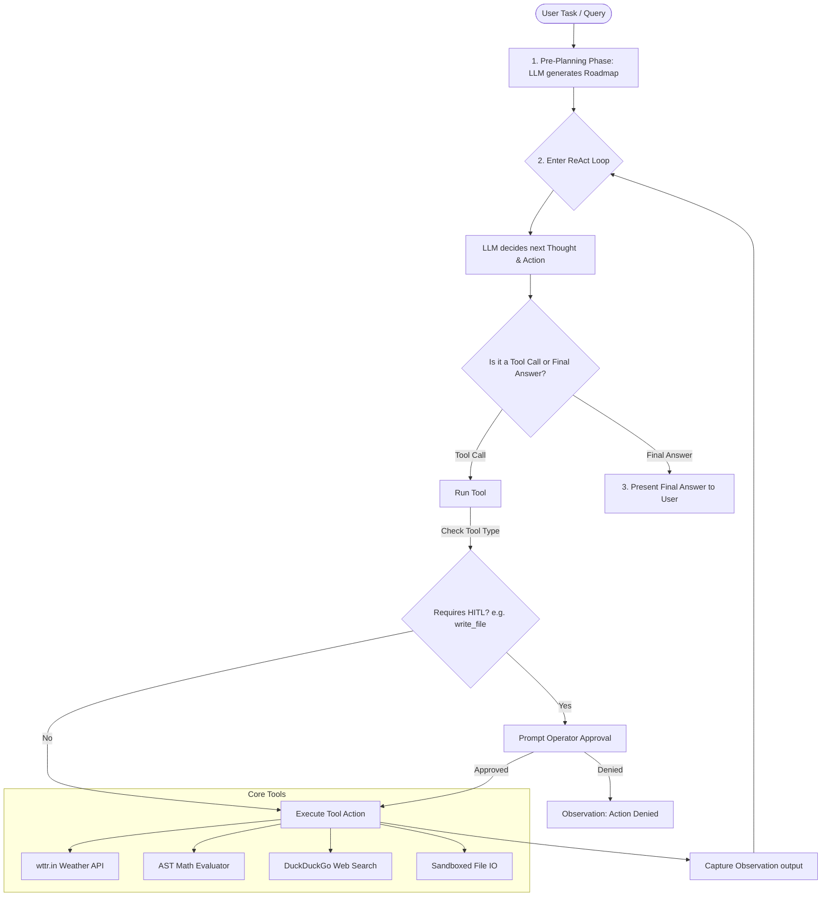

# Project Overview: ReAct AI Agent Studio

This document provides a detailed, comprehensive breakdown of the ReAct AI Agent Studio architecture, explaining the system design, file purposes, and specific function usages in a readable format suitable for both technical developers and non-technical stakeholders.

---

## 🧠 What is a ReAct Agent?

**ReAct** stands for **Reasoning + Acting**. Standard LLM prompts ask the model to answer a question directly. In contrast, a ReAct agent breaks down complex, multi-step problems by iteratively alternating between:
1. **Thought**: The agent reasons about the current state and determines what information it needs next.
2. **Action**: The agent executes an external tool (e.g. searching the web or calculating math) to obtain that information.
3. **Observation**: The agent receives the tool's output as context and starts the next reasoning step.

---

## 🏗️ System Architecture

The project consists of three main parts:
- **Core Engine & Tools**: The ReAct execution loop, unified API clients (Gemini, OpenAI, and Groq), and sandboxed execution tools.
- **Console Interface (CLI)**: A command-line program with styled logs for local executions.
- **Web Dashboard Studio**: A light-mode biscuit and chocolate-brown glassmorphic FastAPI interface featuring Server-Sent Events (SSE) for real-time trace streaming and Human-in-the-Loop (HITL) approval popups.

---

## 📁 File Breakdown & Usage

### 1. Workspace Root Configurations
- **[.gitignore](file:///media/surya/windows/Users/chint/Desktop/GPP/React-Ai-agent/.gitignore)**: Prevents check-in of temporary virtual environments (`.venv`), env secrets (`.env`), cached caches (`__pycache__`), and local reports.
- **[requirements.txt](file:///media/surya/windows/Users/chint/Desktop/GPP/React-Ai-agent/requirements.txt)**: Specifies package dependencies (`openai`, `groq`, `fastapi`, `uvicorn`, `duckduckgo_search`, `rich`, `jinja2`).
- **[.env.example](file:///media/surya/windows/Users/chint/Desktop/GPP/React-Ai-agent/.env.example)**: Explains the environment settings for selecting providers and adding API keys.
- **[Dockerfile](file:///media/surya/windows/Users/chint/Desktop/GPP/React-Ai-agent/Dockerfile)** & **[docker-compose.yml](file:///media/surya/windows/Users/chint/Desktop/GPP/React-Ai-agent/docker-compose.yml)**: Containers configurations to run the FastAPI app in any environment.
- **[main.py](file:///media/surya/windows/Users/chint/Desktop/GPP/React-Ai-agent/main.py)**: CLI entrypoint. Takes user console commands and logs colored step traces using `rich`.

### 2. Core Agent Module (`agent/`)
- **[agent/tools.py](file:///media/surya/windows/Users/chint/Desktop/GPP/React-Ai-agent/agent/tools.py)**: Contains the python methods matching each tool and definitions of their JSON parameters.
- **[agent/llm.py](file:///media/surya/windows/Users/chint/Desktop/GPP/React-Ai-agent/agent/llm.py)**: Adapts requests/responses into standard structures. Can connect to Google Gemini, OpenAI, or Groq.
- **[agent/core.py](file:///media/surya/windows/Users/chint/Desktop/GPP/React-Ai-agent/agent/core.py)**: The main runner containing the ReAct loop algorithm, pre-planning, system prompt configurations, and exception recovery.

### 3. Web Dashboard Module (`web/`)
- **[web/app.py](file:///media/surya/windows/Users/chint/Desktop/GPP/React-Ai-agent/web/app.py)**: FastAPI backend implementing SSE routes and wait states for user feedback (HITL).
- **[web/templates/index.html](file:///media/surya/windows/Users/chint/Desktop/GPP/React-Ai-agent/web/templates/index.html)**: Front-end dashboard styled in cozy biscuit-light and chocolate-brown.

### 4. Tests Module (`tests/`)
- **[tests/test_agent.py](file:///media/surya/windows/Users/chint/Desktop/GPP/React-Ai-agent/tests/test_agent.py)**: Unit tests verifying AST math expression safety, sandbox directory guards, and LLMClient providers initialization.
- **[tests/test_react_loop.py](file:///media/surya/windows/Users/chint/Desktop/GPP/React-Ai-agent/tests/test_react_loop.py)**: Integration tests simulating planning and step sequences using mock LLM responses.

---

## ⚙️ Function & Class Reference

### 🛠️ Tool Core: `agent/tools.py`

#### `SafeEval` (Class)
A utility class designed to safely evaluate simple arithmetic strings without exposing the system to `eval()` code injection.
*   **`_eval(node)`**: A recursive classmethod that processes Abstract Syntax Tree (AST) structures. Supported nodes are `ast.Expression`, `ast.BinOp` (addition, subtraction, multiplication, division, modulo, exponents), `ast.UnaryOp` (negation), and `ast.Constant` (numerical constants). TypeErrors are thrown for unauthorized syntax.
*   **`safe_eval(expr_str)`**: A classmethod that parses a string into an AST tree and calls `_eval` to compute the math value.

#### Tool Functions
*   **`get_weather(city: str) -> str`**: Fetches real-time weather information from `wttr.in` for the specified city.
*   **`calculate(expression: str) -> str`**: Invokes `SafeEval.safe_eval` to compute mathematical calculations safely.
*   **`search_web(query: str) -> str`**: Uses DuckDuckGo search to fetch top snippets from the web.
*   **`read_file(path: str) -> str`**: Safely opens a file in the workspace directory. Includes safety validation to block attempts at reading paths outside the workspace folder (e.g. `../../etc/passwd`).
*   **`write_file(path: str, content: str) -> str`**: Safely writes content to a file inside the workspace boundaries (subject to HITL gate checks).

---

### 🌐 LLM Integration: `agent/llm.py`

#### `ToolCall` (Dataclass)
Represents a structured request from the LLM to execute a tool.
*   **Fields**: `name` (str) and `input_args` (dict).

#### `LLMResponse` (Dataclass)
Standardized response format returned from the LLM model to the core loop.
*   **Fields**: `stop_reason` (str: either `"tool_use"` or `"end_turn"`), `content` (str: the reasoning text), and `tool_use_block` (Optional[ToolCall]).

#### `LLMClient` (Class)
Adapts and channels queries to different model API backends.
*   **`__init__()`**: Initializes the client wrapper. Configures connections and validates key setups for the selected provider (Gemini, OpenAI, or Groq).
*   **`call(messages, tools) -> LLMResponse`**: Standard API entry point. Converts message histories, runs the target provider completion call (utilizing either OpenAI or Groq client packages), and formats the output as an `LLMResponse`.

---

### 🔄 Core Engine: `agent/core.py`

#### `AgentEventHandler` (Class / Interface)
A callback listener interface. Developers inherit from this class to hook into events occurring inside the ReAct execution loop:
*   `on_plan_created(plan: str)`: Called when the pre-planning phase completes.
*   `on_step_start(step: int, max_steps: int)`: Marks the start of a ReAct iteration.
*   `on_thought(step: int, thought: str)`: Captures the agent's internal reasoning.
*   `on_action(step: int, tool_name: str, tool_input: dict)`: Captures the tool name and inputs.
*   `on_hitl_request(tool_name: str, tool_input: dict) -> bool`: Prompts the user/system for side-effect operations approval.
*   `on_observation(step: int, observation: str)`: Captures tool execution results.
*   `on_complete(final_answer: str)`: Signals successful loop completion.
*   `on_timeout(max_steps: int)`: Signals termination due to reaching maximum allowed steps.
*   `on_error(error_msg: str)`: Triggers if an unexpected runtime exception happens.

#### Execution Runner
*   **`run_agent(task, max_steps, enable_planning, event_handler) -> str`**: Sets up the agent system prompts and handles the execution:
    1. **Pre-planning (Optional)**: Requests the LLM to generate a roadmap.
    2. **Loop Iterations**: Sends the current conversational history to the LLM. If the LLM requests a tool call:
        - Runs safety/HITL checks.
        - Executes the tool and gets the output.
        - Returns the output to the conversation history as an observation.
        - If the tool fails, passes the error back to the LLM (allowing self-healing recovery).
    3. **Terminators**: Stop execution if a final answer is produced or `max_steps` is exceeded.

---

### 🖥️ Interface & Server Modules

#### `main.py`
*   **`ConsoleAgentEventHandler`**: Subclasses `AgentEventHandler` to print colored traces to the console using `rich.console`. Shows Thoughts inside yellow boxes, Actions in purple, Observations in green, and Roadmaps in cyan.
*   **`main()`**: CLI script entrypoint. Sets up the argparser, checks environmental configuration, and triggers `run_agent`.

#### `web/app.py`
*   **`WebAgentEventHandler`**: Bridges the asynchronous FastAPI routes with the thread execution. Puts agent callback notifications inside a thread-safe Queue and blocks threads using a `threading.Event` when wait-state (HITL) approval is requested.
*   **`index(request: Request)`**: Serves the main glassmorphic HTML page.
*   **`run_agent_api(task, max_steps, enable_planning, provider)`**: Launches `run_agent` on a separate background thread, and uses `StreamingResponse` to push queue items to the browser as Server-Sent Events (SSE).
*   **`approve_action(payload: dict)`**: Receives POST approvals or denials from the frontend modal buttons and triggers the wait-state `threading.Event`.
